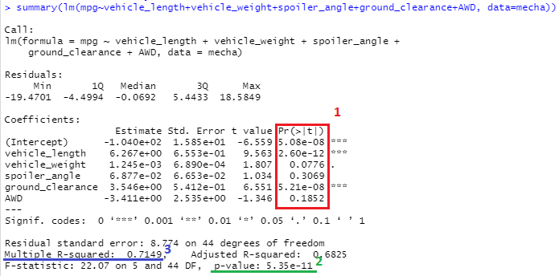
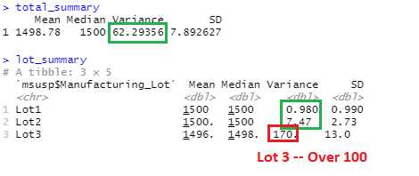
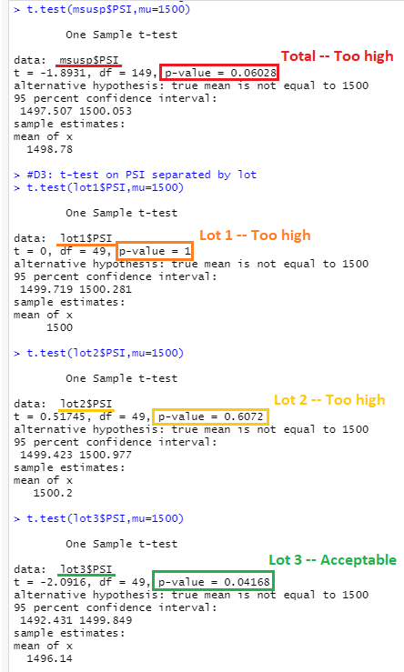

# MechaCar_Statistical_Analysis

## Linear Regression to Predict MPG
<!-- * Which variables/coefficients provided a non-random amount of variance to the mpg values in the dataset? -->
1. The variables which provided non-neglible amounts of variance to the mpg values were spoiler_angle, AWD, and vehicle_length. This analysis is based on the 'Pr(>|t|)' values of approximately .31, .19, and .08 respectively.
  
<!-- * Is the slope of the linear model considered to be zero? Why or why not? -->
2. The slope of the linear model is not zero. The p-value of the regression analysis is 5.35 e-11. This is much lower than the standard p-value of 0.05. Thus we can confidently reject the null hypothesis and we can assert that the slope is not zero.
  
<!-- * Does this linear model predict mpg of MechaCar prototypes effectively? Why or why not? -->
3. Since the Multiple R-squared value is approximately 0.72 (or 0.68 adjusted) we can say that there is a strong correlation between the MPG and this set of variables. Further testing may be needed to more accurately identify the exact strength of each individual variable in the set on the MPG.

The linear model results behind the above analysis can be seen in the picture below.

  
## Summary Statistics on Suspension Coils
<!-- * The design specifications for the MechaCar suspension coils dictate that the variance of the suspension coils must not exceed 100 pounds per square inch. Does the current manufacturing data meet this design specification for all manufacturing lots in total and each lot individually? Why or why not? -->
1. In total the MechaCar suspension coil requirement is met, as the variance is 62.29 PSI which does not exceed 100 PSI as per design specifications. 
2. When the data is grouped by Lot Number there is a single problematic lot: Lot #3. This lot has a variance of approximately 170 PSI which is nearly double the acceptable variance allowed. On the other hand lot 1 has a variance of 1 PSI, while lot 2 has a variance of 7.5 PSI, both of which are well within the tolerable range.

Reference the image below to view the variances for each sample.

  
## T-Tests on Suspension Coils
<!-- * Briefly summarize your interpretation and findings for the t-test results. Include screenshots of the t-test to support your summary. -->
1. While the result of the aggregate t-test is close to the standard allowing for rejection of the null hypothesis, currently the p-value is 0.06. This is slightly higher than the standard value of 0.05, which means we are NOT able to reject the null hypothesis of this t-test. In other words, we cannot say with true confidence that the mean of an aggregate sample is not 1500.
2. Similarly the t-tests for lots 1 and 2 do not allowing for rejection of the null hypothesis. Their p-values of 1 and 0.61 respectively are far higher than the standard value of 0.05. Only the t-test on lot 3 vehicles has a p-value of 0.04, which does allow us to reject the null hypothesis and conclude the true mean based on the lot 3 sample is not equal to 1500.

The results of each t-test can be found in the picture below.

  
## Study Design: MechaCar vs Competition
